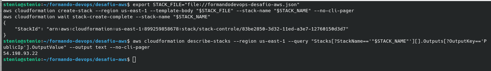
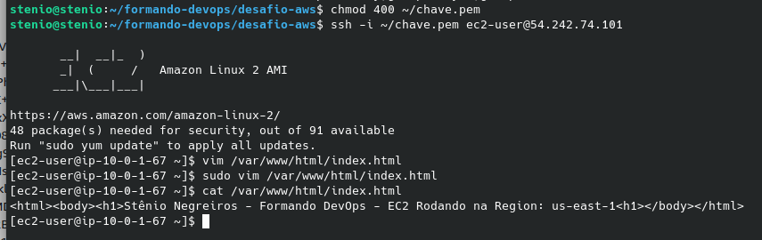

## Respostas Desafio AWS

### 1- Setup de ambiente

Stack do ambiente criado conforme orientações
 

### 2 - Networking

O erro é devido o Security Group estar liberando as portas TCP no intervalo 81 - 8080, para origem 0.0.0.0/1.
Para corrigir e deixar o servidor web acessível, é necessário alterar a regra de entrada para liberar HTTP, na porta 80, para qualquer origem 0.0.0.0/0. Após isso, a página ficou acessível.

 

### 3 - EC2 Access

Seguindo [esse tutorial da AWS](https://aws.amazon.com/pt/premiumsupport/knowledge-center/ec2-windows-replace-lost-key-pair/), posso substituir o par de chaves perdidos na instância que está rodando por meio de uma automação pronta do Systems Manager.

Vou no item `Automação > Executar` e escolho o documento `AWSSupport-ResetAccess`.
 

coloco o id da minha instância `i-076e83ec1d3d9ae9c`, executo e aguardo a conclusão.
 

Após isso, vou em `Systems Manager > Parameter Store` e lá estará a nova chave privada criptografada que usarei para acessar a instância. Copio o conteúdo da chave, crio um arquivo de texto na minha máquina local chamado `chave.pem` e altero as permissões para 400. Após isso, preciso alterar o Security Group do servidor web para permitir acesso via SSH do meu IP, e poderei acessar normalmente a instância, e incluir meu nome no arquivo `/var/www/html/index.html`. 
 

### 4 -  EC2 Troubleshooting
Ao executar o comando `ps -ax | grep httpd` confirmo que o serviço do apache não subiu após o reboot. Para configurá-lo para subir de forma automática, é necessário executar o comando `sudo systemctl enable httpd`. Após isso reinicio a instância e vejo que o serviço está funcionando corretamente, ao acessar o novo IP público pelo navegador. 

### 5 - Balanceamento 
 Seleciono a minha instância, vou em `Ações > Imagen e modelos > Criar imagem`
E escolho as opções para minha AMI personalizada.

Depois disso, posso ir no menu lateral esquerdo em `Imagens > AMI` e lá estará a AMI, que eu posso selecionar e executar nova instância a partir dela. Obs: Para alta disponibilidade a nova instância foi criada na subnet da outra AZ, no caso us-east-1b.

Após isso, vou em `Balanceamento de carga > Grupos de destino` e crio um target group incluindo as duas instâncias na VPC Formando DevOps. 

Feito isso, posso ir em `Load Balancers` e criar meu Application Load Balancer (ALB), associado ao target group definido, e usando um novo security group específico liberando tráfego http.

Para diferenciar as duas instâncias, vou no `/var/www/html/index.html`e adiciono uma nova linha indicando que uma é o servidor na AZ1 e a outra é o clone na AZ2. Após acessar o DNS do meu ALB, terei os resultados: 

## 6 - Segurança

Para garantir que as instâncias aceitem chamadas HTTP apenas do ALB, é necessário editar o security group dos servidores Web para que a regra http aceite apenas como origem o security group do ALB.

Dessa forma, ao fazer testes tentando acessar diretamente o IP público do servidor via HTTP não obtenho resposta, mas consigo normalmente via o DNS do ALB. 
