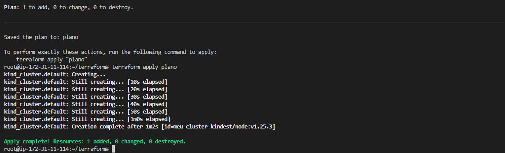
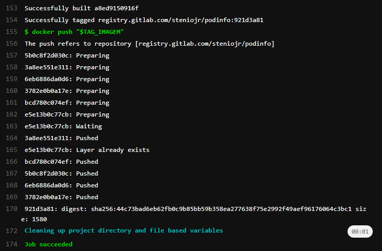
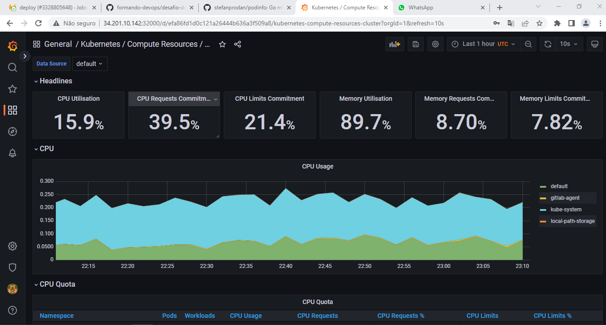

# Desafio DevOps - Respostas

Este arquivo contém as respostas e evidências dos principais pontos que fiz no desafio.

## 2 - Terraform

Começando pelo terraform, fiz a criação do cluster kind usando o arquivo `main.tf` criado:

```
terraform {
  required_providers {
    kind = {
      source = "tehcyx/kind"
      version = "0.0.15"
    }
  }
}

provider "kind" {}

resource "kind_cluster" "default" {
  name = "meu-cluster"
  node_image = "kindest/node:v1.25.3"

  kind_config {
    kind = "Cluster"
    api_version = "kind.x-k8s.io/v1alpha4"

    node {
      role = "control-plane"
    }

    node{
      role = "worker"

      extra_port_mappings {
        container_port = 31900
        host_port = 31900
      }

      extra_port_mappings {
        container_port = 32000
        host_port = 32000
    }
  }
}
```



Também usei o terraform para criar o repositório do desafio, usando o meu arquivo `repo.tf`:

```
terraform {
  required_providers {
    gitlab = {
      source = "gitlabhq/gitlab"
      version = "3.19.0"
    }
  }
}

variable "gitlab_token"{
  type = string
  description = "API token passado por variável de ambiente"
}

provider "gitlab" {
  token = var.gitlab_token
  base_url = "https://gitlab.com/api/v4"
}

resource "gitlab_project" "repo" {
  name = "podinfo"
  description = "Repositório do desafio final de DevOps, usando a aplicação podinfo"
  visibility_level = "public"
  import_url  = "https://github.com/stefanprodan/podinfo.git"
}
``` 

___

## 1 - Pipeline

Após a criação do cluster e do repositório, fiz o clone do repo na minha máquina e criei o pipeline no arquivo `.gitlab-ci.yml`:
```yml
stages:
  - lint
  - build
  - scan
  - deploy

lint:
  image: hadolint/hadolint:latest-debian
  stage: lint
  script:
    - hadolint Dockerfile --failure-threshold=warning
    # faz o lint e retorna exit code 1 caso o nível for warning ou acima
  rules:
    - if:
      exists:
      - Dockerfile

docker-build:
  image: docker:latest
  stage: build
  services:
    - docker:dind
  before_script:
    - docker login -u "$CI_REGISTRY_USER" -p "$CI_REGISTRY_PASSWORD" $CI_REGISTRY
    - GITLAB_USER_LOGIN=$GITLAB_USER_LOGIN| tr '[:upper:]' '[:lower:]'
    # convertendo o user_login para minusculo pois estava dando erro
    - TAG_IMAGEM="$CI_REGISTRY/$GITLAB_USER_LOGIN/podinfo:$CI_COMMIT_SHORT_SHA"
  script:
    - echo $TAG_IMAGEM
    - docker build --pull -t "$TAG_IMAGEM" .
    - docker push "$TAG_IMAGEM"
  rules:
    - if:
      exists:
        - Dockerfile

trivy:
  image: alpine
  stage: scan
  before_script:
    - IMAGEM="$CI_REGISTRY/$GITLAB_USER_LOGIN/podinfo:$CI_COMMIT_SHORT_SHA"
    - apk add curl
    - curl -sfL https://raw.githubusercontent.com/aquasecurity/trivy/main/contrib/install.sh | sh -s -- -b /usr/local/bin
  script:
    - trivy image --no-progress --exit-code 1 --severity CRITICAL $IMAGEM
    # Exit code 1 caso a severidade seja crítica


deploy:
  image:
    name: bitnami/kubectl:latest
    entrypoint: ['']
  variables:
    TAG: $CI_COMMIT_SHORT_SHA
  stage: deploy
  script:
    - kubectl config get-contexts
    - kubectl config use-context steniojr/podinfo:agente-kube
    - echo $TAG
    - sed -i "s/<TAG>/$TAG/g" deploy-podinfo.yml
    - cat deploy-podinfo.yml
    - kubectl create -f deploy-podinfo.yml
```
- **Lint**:

Na etapa de lint, com o Dockerfile original do podinfo, o pipeline quebrava devido a um warning:


Após colocar a versão dos pacotes conforme sugerido pelo hadolint, o warning não aparece mais e o lint retorna exit code 0, seguindo a pipeline.

- **Build**:



- **Scan**:

Scan usando uma imagem alpine e instalando o trivy

[](./imagens/trivy.png)

- **Deploy**:

Para ser possível fazer o deploy dentro da pipeline usei o CI/CD workflow agent, instalado de acordo com a documentação.


Após o deploy usando o manifesto `deploy-podinfo.yml`:


## 3 - Kubernetes

Manifestos:
- Deployment
```yaml
apiVersion: apps/v1
kind: Deployment
metadata:
  name: podinfo
  labels:
    app: podinfo
spec:
  replicas: 1
  selector:
    matchLabels:
      app: podinfo
  template:
    metadata:
      labels:
        app: podinfo
    spec:
      containers:
      - image: registry.gitlab.com/steniojr/podinfo:bef06b7e
        name: podinfo
        ports:
        - containerPort: 9898
          protocol: TCP
        resources:
          requests:
            memory: "32Mi"
            cpu: "128m"
          limits:
            memory: "64Mi"
            cpu: "256m"
        livenessProbe:
          httpGet:
            port: 9898
            path: /healthz
          initialDelaySeconds: 5
          periodSeconds: 10
        readinessProbe:
          httpGet:
            port: 9898
            path: /healthz
          initialDelaySeconds: 5
          periodSeconds: 10

```
- **Service**:
```yaml
apiVersion: v1
kind: Service
metadata:
  labels:
    app: podinfo
  name: podinfo
  namespace: default
spec:
  clusterIPs:
  externalTrafficPolicy: Cluster
  internalTrafficPolicy: Cluster
  ipFamilies:
  - IPv4
  ipFamilyPolicy: SingleStack
  ports:
  - nodePort: 31900
    port: 9898
    protocol: TCP
    targetPort: 9898
  selector:
    app: podinfo
  sessionAffinity: None
  type: NodePort
```
Expondo pelo service NodePort porta 31900 para teste


## 4 - Observabilidade

Instalei a stack de observabilidade usando helm
```
helm repo add prometheus-community https://prometheus-community.github.io/helm-charts
helm repo update
helm install prometheus prometheus-community/kube-prometheus-stack
```
Depois de instalado, também criei um service NodePort na porta 32000 para testar pelo grafana as dashboards com as métricas coletadas.

 




Ainda ficou faltando os outros itens, pois preciso estudar melhor o prometheus, e então irei implementar.