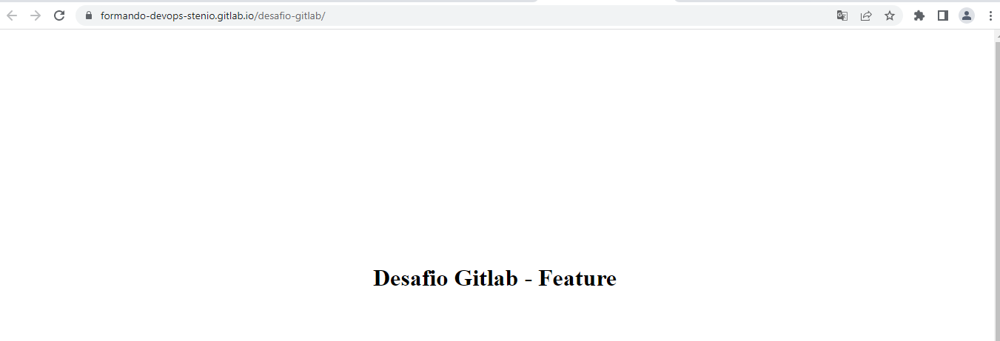

__________________________
## Respostas

**2 -** Crio uma chave SSH com o comando`ssh-keygen` e depois configuro a chave pública no gitlab, indo no ícone do usuário, depois em `Preferences > SSH keys`. Após isso posso fazer o `git clone git@gitlab.com:formando-devops-stenio/desafio-gitlab.git` do repositório.


**3 -** Faço a cópia de todos os arquivos na pasta usando o comando `cp -r * ~/desafio-gitlab/`, adiciono os novos arquivos com `git add *` e faço o commit com `git commit`

**4 -** Uso o comando `git push origin main` para fazer o push dos arquivos adicionados no repositório local pelo commit.

**5 -** Altero o texto do index.html usando o vim

**6 -** Uso o comando `git checkout -b feature` para criar a nova branch, e após isso altero o texto.

**7 -** Crio o arquivo `.gitlab-ci.yml` baseado no template de página html simples que está na documentação do gitlab. 

```yml
## Usando template para página html simples
pages:
  stage: deploy
  environment: production
  script:
    - echo "Página html já criada"
  artifacts:
    paths:
      - public
```
Após subir fazer o commit e fazer o push com `git push origin feature`, o arquivo irá rodar o pipeline e disponibilizar a página html.

**8 -** Alterno novamente para a branch main com `git checkout main` e depois faço o merge com `git merge feature` e para finalizar faço o push do main.

**9 -** Na GUI do gitlab, indo em `settings > pages` encontro a minha página.


**11 -** 

Link do repositório: https://gitlab.com/formando-devops-stenio/desafio-gitlab

Link da minha página: https://formando-devops-stenio.gitlab.io/desafio-gitlab

Log do git:
```
commit 94f6fa5091dd0ea52fd793383a15267667ad926c (HEAD -> main, origin/main, origin/feature, origin/HEAD, feature)
Author: Stênio Negreiros <steniojuniorsb@gmail.com>
Date:   Wed Oct 12 22:06:26 2022 -0300

    Alterando - Feature no html.index e criando pipeline CI

commit 373de536aa9f58ff8defecf87382d4259f94769f
Author: Stênio Negreiros <steniojuniorsb@gmail.com>
Date:   Wed Oct 12 22:02:26 2022 -0300

    Adicionando - Dev no index.html

commit 39ee8a72fcd4bc542f74c582e61f2040b48f037b
Author: Stênio Negreiros <steniojuniorsb@gmail.com>
Date:   Wed Oct 12 22:01:21 2022 -0300

    Adicionando arquivos do desafio

commit ffe84e0f700b44bc000e47f12d309ce9af326a07
Author: Stênio Negreiros <steniojuniorsb@gmail.com>
Date:   Thu Oct 13 01:00:13 2022 +0000

    Initial commit
```

